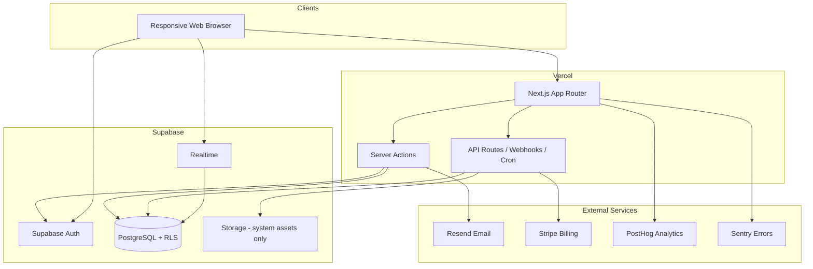

# SameLobby Implementation Plan

**Status:** Planning artifact — no application code implemented  
**Prepared:** July 8, 2026  
**Audience:** Solo founder using Cursor for AI-assisted development  
**Controlling product baseline:** `SameLobby_Comprehensive_Solo_Founder_Product_MVP_and_Build_Plan_FINAL.docx` (read in full; external copy at `C:\Users\barne\Downloads\SameLobby_Comprehensive_Solo_Founder_Product_MVP_and_Build_Plan_FINAL.docx`)

---

## 1. Executive implementation decision

### Current repository condition

**Category: Empty repository (git initialized, zero commits, zero application files).**

| Item                              | State                                                              |
| --------------------------------- | ------------------------------------------------------------------ |
| Git                               | `main` branch, no commits                                          |
| Remote                            | `origin` → `https://github.com/DeputyFifeofMayberry/SameLobby.git` |
| Application code                  | None                                                               |
| `package.json` / lock files       | None                                                               |
| Framework config                  | None                                                               |
| Supabase / migrations             | None                                                               |
| CI/CD                             | None                                                               |
| Tests                             | None                                                               |
| Documentation (besides this plan) | None                                                               |

### Recommended implementation approach

Build SameLobby as a **modular monolith**: one Next.js (TypeScript) web application with three route surfaces (public marketing, authenticated app, founder admin), one Supabase PostgreSQL project per environment, server-enforced authorization on every mutation, and **vertical slices** that each deliver a testable user path.

**Sequence:**

1. **Slice 0 (Phase 1):** Product design and content system — flows, IA, tokens, terminology, prototype routes (no production feature logic).
2. **Slice 1 (first coding milestone):** Deployable foundation — auth, adult attestation, account model, RLS skeleton, CI, staging.
3. **Slices 2–10:** Profile → discovery → connections → messaging → play → teammates/groups → moderation/privacy → subscription → hardening → capped release.

Do **not** scaffold the full database before Slice 1 is deployed and testable. Add tables per slice with deny-by-default RLS and pgTAP tests in the same migration tranche.

### First coding milestone

**Slice 1 — Repository foundation, deployment, application shell, authentication, adult attestation, account security, and deletion skeleton.**

Outcome: A founder can sign up via magic link, attest 18+, land in an authenticated shell, and request account deletion — deployed to staging with CI green and RLS deny-by-default tests passing.

### Why this sequence fits a solo founder

- Each slice produces something **deployable and demoable**, reducing rework and context loss between Cursor sessions.
- Security, privacy, and relationship permissions are established in Slice 1, not bolted on after messaging.
- The SameLobby Loop (Discover → Connect → Talk → Play → Continue) is preserved in slice order without building discovery before profiles or messaging before mutual connection.
- Subscription and catalog completion are explicitly deferred until the relationship loop and safety controls stabilize.

### What is explicitly not being built yet

- Discovery, recommendations, search, cohort density gates
- Connection requests, messaging, realtime chat
- Play invitations, sessions, post-play continuation
- Teammates, private groups, group chat
- Reporting, moderation console (beyond permission foundation)
- Stripe billing and entitlements
- Game catalog beyond seed stubs
- Native apps, voice/video, user media uploads, public feeds, swipe UI
- Production public registration (invite-only until launch controls exist)

---

## 2. Source-of-truth and authority

### Controlling final document

| Document                                                                     | Role                                                                                                                                                                                                                         |
| ---------------------------------------------------------------------------- | ---------------------------------------------------------------------------------------------------------------------------------------------------------------------------------------------------------------------------- |
| `SameLobby_Comprehensive_Solo_Founder_Product_MVP_and_Build_Plan_FINAL.docx` | **Authoritative** — product identity, MVP scope, journeys, IA, screens, profile/discovery, messaging, play, continuity, trust/safety, privacy, monetization, brand, architecture, data model, admin, phases, testing, launch |

### Relevant repository sources

| Source                                         | Role                                                      |
| ---------------------------------------------- | --------------------------------------------------------- |
| `SAMELOBBY_IMPLEMENTATION_PLAN.md` (this file) | Engineering decomposition derived from the final document |
| `docs/decisions/` (to be created in Slice 1)   | Lightweight ADR log for material technical choices        |
| `docs/design/` (Slice 0)                       | Flows, tokens, terminology, visibility model              |

### Conflicts found

| Conflict                                                                                              | Resolution                                                                               |
| ----------------------------------------------------------------------------------------------------- | ---------------------------------------------------------------------------------------- |
| User query referenced `SameLobby_Comprehensive_Solo_Founder_Product_MVP_and_Build_Plan_FINAL(1).docx` | File on disk is `..._FINAL.docx` (no `(1)`). Treated as the same authoritative document. |
| No prior SameLobby planning docs in repository                                                        | N/A — empty repo; final document controls without merge conflict.                        |

### Unresolved decisions materially affecting implementation

See **Section 19**. None are CRITICAL blockers for Slice 0 or Slice 1 planning; several are ELEVATED before discovery (Slice 3) or public registration (Slice 8+).

---

## 3. Repository baseline

### Current directory structure

```
SameLobby/
└── .git/
```

After this planning task:

```
SameLobby/
├── .git/
└── SAMELOBBY_IMPLEMENTATION_PLAN.md
```

### Existing technologies

None in repository. **Planned baseline** (verify versions at Slice 1 implementation):

| Technology     | Planned version / note                         | Verification status                                                                          |
| -------------- | ---------------------------------------------- | -------------------------------------------------------------------------------------------- |
| Next.js        | **16.2.x** (current stable per npm, July 2026) | Verified via npm registry; re-check before `create-next-app`                                 |
| React          | Bundled with Next.js 16                        | Confirm at init                                                                              |
| TypeScript     | `strict: true`                                 | Standard with Next.js template                                                               |
| Node.js        | LTS (22.x recommended)                         | Confirm local/CI at init                                                                     |
| Supabase CLI   | Latest stable                                  | Confirm at `supabase init`                                                                   |
| PostgreSQL     | Supabase-managed                               | —                                                                                            |
| Vitest or Jest | For unit/integration                           | Choose in Slice 1; Vitest preferred for speed                                                |
| Playwright     | E2E (later slices)                             | Add in Slice 4+                                                                              |
| pgTAP          | RLS tests via `supabase test db`               | [Supabase testing docs](https://supabase.com/docs/guides/local-development/testing/overview) |

### Existing code to retain

None.

### Existing code to replace or refactor

None.

### Missing foundation (all required)

- Next.js application scaffold
- ESLint, Prettier, TypeScript strict config
- Environment validation (`@t3-oss/env-nextjs` or equivalent)
- Supabase local + staging projects
- Migration and RLS test harness
- Vercel project + GitHub integration
- CI workflow
- Public/authenticated/admin route groups
- Auth middleware and session handling
- Feature flag registry
- Analytics allowlist registry
- Error monitoring with scrub rules

### Technical debt already present

None (greenfield).

### Assumptions made

1. Founder has or will create Supabase, Vercel, GitHub, Resend, and (later) Stripe accounts.
2. Initial deployment target is **United States, English only**.
3. No existing production users or legacy data to migrate.
4. Founder will use **separate everyday and privileged admin accounts** before admin UI ships.
5. Legal/privacy counsel review occurs **before public registration**, not before Slice 1.
6. Service prices in the final document are planning estimates — recheck vendor pricing before purchase.

---

## 4. Locked architecture

### Application architecture

**Modular monolith** with domain modules under `src/domains/*`, shared infrastructure under `src/lib/*`, and route groups under `src/app/*`.

| Surface           | Path prefix | Auth                        | Purpose                                                    |
| ----------------- | ----------- | --------------------------- | ---------------------------------------------------------- |
| Public site       | `(public)/` | Anonymous                   | Marketing, safety center, pricing, help, sign-in entry     |
| Authenticated app | `(app)/`    | Supabase session required   | Discover, connections, messages, play, teammates, settings |
| Founder admin     | `(admin)/`  | Session + admin scope + MFA | Moderation, catalog, audit, feature controls               |

### Server vs client component rules

| Use Server Components            | Use Client Components                          |
| -------------------------------- | ---------------------------------------------- |
| Data fetching with authorization | Interactive forms with immediate validation UX |
| Layout shells, static content    | Realtime subscriptions (messages)              |
| Initial page data                | Dialogs, toasts, focus traps                   |
| SEO public pages                 | Bottom nav, keyboard shortcuts in app shell    |

**Rule:** Never pass service-role keys or privileged tokens to client bundles. Realtime channels use user JWT only; server validates membership before subscribe.

### Server action vs API route rules

| Server Actions                                           | API Routes (`/api/*`)                            |
| -------------------------------------------------------- | ------------------------------------------------ |
| Form mutations from authenticated UI                     | Webhooks (Stripe, signed)                        |
| Profile updates, connection accept/decline               | Health check (`/api/health`)                     |
| Idempotent user-initiated mutations with CSRF protection | Cron/scheduled job ingress (shared secret)       |
| Revalidation after mutation                              | External integrations requiring raw request body |

**Rule:** All mutations re-validate session server-side; never trust `user_id`, `role`, or `owner_id` from client body without matching `auth.uid()`.

### Database access rules

| Context                      | Client                                                                                          |
| ---------------------------- | ----------------------------------------------------------------------------------------------- |
| Browser (authenticated user) | `@supabase/ssr` with anon key + user JWT; RLS enforced                                          |
| Server Components / Actions  | `@supabase/ssr` user-scoped client OR service role only in isolated `src/lib/supabase/admin.ts` |
| Background jobs              | Service role with explicit function allowlist                                                   |
| Admin console                | Service role via server-only routes; case-scoped queries                                        |

**Deny-by-default:** Every new `public` table ships with `ENABLE ROW LEVEL SECURITY` and no permissive policies until slice requirements are defined.

### Authentication and session handling

- **Primary:** Supabase Auth email magic link (MVP).
- **Sessions:** HTTP-only cookies via `@supabase/ssr`; secure, SameSite=Lax (Strict where compatible).
- **Recent authentication:** Required for deletion, billing changes, email change — via Supabase `aal` or re-send magic link challenge (confirm pattern at implementation).
- **Passkeys:** Deferred post-MVP per final document.

### Background-job approach

- **Vercel Cron** or Supabase `pg_cron` + Edge Function for: intent expiry, message retention, deletion stages, reminder dispatch, moderation SLA timers, Stripe reconciliation.
- Jobs are idempotent; use `job_runs` table with unique `(job_name, idempotency_key)`.

### Realtime approach

- Supabase Realtime on `messages` insert/update for conversation participants only.
- Server authorizes conversation membership before client subscribes.
- No realtime on discovery, reports, or admin evidence.

### Email boundary

- **Resend** for transactional email only (auth magic links via Supabase SMTP config pointing to Resend, plus app notifications).
- Templates in `src/emails/`; no message bodies in email except minimal safe previews approved by template registry.

### Billing boundary

- **Stripe Checkout + Customer Portal + webhooks** (Slice 9).
- SameLobby stores Stripe customer/subscription IDs and derived entitlements only — never card data.

### Analytics boundary

- **PostHog** (or equivalent) with **allowlisted events only** (`src/lib/analytics/events.ts`).
- No session replay on messages, profiles, reports, or admin.
- No message text, report evidence, sensitive preferences, or external handles in event properties.

### Error-monitoring boundary

- **Sentry** (or equivalent) with aggressive `beforeSend` scrubbing.
- Strip message bodies, tokens, emails, report content, preference values.

### Admin privilege boundary

- Separate `admin_users` table mapping `user_id` → scopes (`support`, `safety_review`, `catalog`, `billing`, `security_break_glass`).
- Privileged routes require scope + MFA (TOTP via Supabase or app-level enforcement — **confirm at Slice 8**).
- Immutable `audit_events` for every privileged read/write.

### Environment separation

| Environment | Database                          | Stripe               | Email                | Analytics          |
| ----------- | --------------------------------- | -------------------- | -------------------- | ------------------ |
| Local       | Supabase local (`supabase start`) | Test mode / disabled | Resend dev / Mailpit | Dev project        |
| Preview     | Staging DB or branch DB           | Test mode            | Staging domain       | Staging project    |
| Staging     | Dedicated Supabase project        | Test mode            | Staging domain       | Staging project    |
| Production  | Dedicated Supabase project        | Live mode            | Production domain    | Production project |

### Feature-flag approach

- `feature_flags` table + `src/lib/feature-flags.ts` server-side reads.
- Flags: `registration_open`, `connection_requests_enabled`, `messaging_enabled`, `discovery_enabled`, `stripe_enabled`, `links_in_messages`, etc.
- Emergency shutdown via admin console updates flag + audit log — no deploy required.

### Architecture diagram



---

## 5. Proposed repository structure

Single package (no monorepo).

```
SameLobby/
├── .github/
│   └── workflows/
│       ├── ci.yml                    # lint, typecheck, unit, RLS tests
│       └── staging-smoke.yml         # post-deploy smoke (optional)
├── docs/
│   ├── decisions/                    # ADR-NNN-*.md
│   ├── design/
│   │   ├── flows/                    # Journey flow markdown + diagrams
│   │   ├── tokens.json               # Design tokens
│   │   ├── terminology.md            # Approved copy
│   │   ├── visibility-model.md       # Public / match-only / connection-only
│   │   └── component-inventory.md
│   └── runbooks/
│       ├── incident-response.md
│       ├── rollback.md
│       └── backup-restore.md
├── public/
│   └── avatars/                      # Generated abstract avatar assets
├── src/
│   ├── app/
│   │   ├── (public)/                 # Marketing, safety, pricing, help
│   │   │   ├── page.tsx              # Home
│   │   │   ├── how-it-works/
│   │   │   ├── safety/
│   │   │   ├── pricing/
│   │   │   ├── help/
│   │   │   └── sign-in/
│   │   ├── (auth)/                   # Auth callback, magic-link landing
│   │   │   └── auth/
│   │   ├── (app)/                    # Authenticated shell
│   │   │   ├── layout.tsx
│   │   │   ├── discover/
│   │   │   ├── connections/
│   │   │   ├── messages/
│   │   │   ├── play/
│   │   │   ├── teammates/
│   │   │   ├── profile/
│   │   │   ├── notifications/
│   │   │   ├── settings/
│   │   │   ├── safety/
│   │   │   ├── onboarding/
│   │   │   └── subscription/
│   │   ├── (admin)/                  # Founder admin (separate layout)
│   │   │   ├── layout.tsx
│   │   │   ├── dashboard/
│   │   │   ├── reports/
│   │   │   ├── cases/
│   │   │   ├── users/
│   │   │   ├── catalog/
│   │   │   ├── audit/
│   │   │   └── feature-controls/
│   │   ├── (prototype)/              # Slice 0 clickable prototype routes
│   │   └── api/
│   │       ├── health/route.ts
│   │       ├── webhooks/stripe/route.ts
│   │       └── cron/[job]/route.ts
│   ├── components/
│   │   ├── ui/                       # Accessible primitives (Button, Dialog, etc.)
│   │   ├── layout/                   # AppShell, PublicNav, AdminNav
│   │   └── domain/                   # Feature-specific composed components
│   ├── domains/
│   │   ├── accounts/
│   │   ├── profiles/
│   │   ├── discovery/
│   │   ├── connections/
│   │   ├── messaging/
│   │   ├── play/
│   │   ├── teammates/
│   │   ├── groups/
│   │   ├── safety/
│   │   ├── moderation/
│   │   ├── billing/
│   │   └── notifications/
│   ├── lib/
│   │   ├── supabase/
│   │   │   ├── client.ts
│   │   │   ├── server.ts
│   │   │   └── admin.ts              # Service role - server only
│   │   ├── auth/
│   │   ├── authorization/            # canViewProfile, canMessage, etc.
│   │   ├── feature-flags.ts
│   │   ├── analytics/events.ts
│   │   ├── logging.ts
│   │   ├── rate-limit.ts
│   │   └── env.ts
│   ├── emails/
│   ├── jobs/                         # Job handlers invoked by cron routes
│   └── styles/
│       └── globals.css
├── supabase/
│   ├── config.toml
│   ├── migrations/                   # Ordered SQL migrations
│   ├── seed.sql                      # Synthetic dev seed
│   └── tests/                        # pgTAP RLS tests
│       ├── helpers.sql
│       └── rls/
├── tests/
│   ├── unit/
│   ├── integration/
│   ├── e2e/                          # Playwright
│   └── fixtures/
├── .env.example
├── .env.local                        # gitignored
├── eslint.config.mjs
├── next.config.ts
├── package.json
├── playwright.config.ts
├── prettier.config.mjs
├── tsconfig.json
└── vitest.config.ts
```

---

## 6. Phase 1 — Product design and content system

**Slice 0 — no production feature logic.** Outputs feed Slice 1+ UI and copy.

### Required outputs

| Output                                  | Description                                     | Repository artifact                                                  |
| --------------------------------------- | ----------------------------------------------- | -------------------------------------------------------------------- |
| Low-fidelity flows                      | All 13 journeys (Section 19 of final doc)       | `docs/design/flows/J01-*.md` … `J13-*.md`                            |
| Responsive IA                           | Public + app nav model                          | `docs/design/information-architecture.md`                            |
| Screen designs                          | One direction per MVP screen (Table 39)         | Figma export **or** `docs/design/screens/` wireframes                |
| Design tokens                           | Colors, type, spacing (Table 71)                | `docs/design/tokens.json` + CSS variables in `src/styles/tokens.css` |
| Component inventory                     | Buttons, cards, nav, forms, chat bubble, etc.   | `docs/design/component-inventory.md`                                 |
| Terminology library                     | Approved/forbidden terms (Table 72)             | `docs/design/terminology.md`                                         |
| Privacy visibility model                | Public / match-only / connection-only / private | `docs/design/visibility-model.md`                                    |
| Moderation workflow                     | Report → case → action → appeal                 | `docs/design/moderation-workflow.md`                                 |
| Empty / loading / error / safety states | Per screen                                      | Annotations in flow docs + `docs/design/states.md`                   |
| Accessibility annotations               | Focus order, live regions, labels               | Per flow in `docs/design/a11y/`                                      |
| Clickable prototype                     | Onboarding through subscription surfaces        | `(prototype)/` routes with static mock data **or** Storybook stories |

### Prototype coverage (minimum)

1. Onboarding (progressive, skip paths)
2. Discovery (recommendations + density empty state)
3. Connection request (incoming/sent)
4. Chat (1:1)
5. Play invitation composer
6. Teammate detail + group create
7. Block and report flows
8. Subscription comparison (no real Stripe)

### Maintenance guidance for solo founder

| Artifact type                  | Tool                                                   | When to update                                 |
| ------------------------------ | ------------------------------------------------------ | ---------------------------------------------- |
| Flows, terminology, visibility | Markdown in `docs/design/`                             | Any UX-impacting slice                         |
| Tokens                         | JSON + CSS                                             | Brand change only                              |
| Interactive components         | Storybook (`stories/`) optional                        | Complex a11y components (Dialog, ChatComposer) |
| Prototype routes               | Delete or gate behind `NODE_ENV` before public release | After Slice 2 UI replaces mocks                |

**Acceptance:** Every MVP screen has one selected design direction; navigation matches Table 37; unresolved choices logged in `docs/decisions/`.

---

## 7. MVP vertical-slice roadmap

### Slice 0: Product design and content system

| Dimension              | Detail                                                          |
| ---------------------- | --------------------------------------------------------------- |
| **User value**         | Aligns build on SameLobby Loop before code diverges             |
| **Included**           | Section 6 outputs                                               |
| **Excluded**           | Production DB, auth, real data                                  |
| **Dependencies**       | Final document                                                  |
| **DB / RLS**           | None                                                            |
| **Routes**             | `(prototype)/*` only                                            |
| **Tests**              | Manual walkthrough checklist                                    |
| **Definition of done** | All 13 flows documented; prototype walkable; terminology locked |

---

### Slice 1: Repository foundation, deployment, shell, auth, attestation, deletion skeleton

| Dimension        | Detail                                                                                                                                                                                                                                                                                                                             |
| ---------------- | ---------------------------------------------------------------------------------------------------------------------------------------------------------------------------------------------------------------------------------------------------------------------------------------------------------------------------------- |
| **User value**   | Secure account creation and sign-in; adult attestation; path to leave platform                                                                                                                                                                                                                                                     |
| **Included**     | Next.js init, CI/CD, env validation, magic link auth, session middleware, public + app layouts, 18+ attestation, consent events, account status model, deletion request skeleton, feature flags, health check, logging/analytics registry, founder admin permission table (no UI), deny-by-default RLS tests, synthetic seed users |
| **Excluded**     | Profile fields beyond account, discovery, messaging, moderation UI                                                                                                                                                                                                                                                                 |
| **Dependencies** | Slice 0 IA for nav labels                                                                                                                                                                                                                                                                                                          |
| **DB**           | `accounts`, `consent_events`, `admin_users`, `feature_flags`, `deletion_requests`, `audit_events` (foundation)                                                                                                                                                                                                                     |
| **RLS**          | Deny all on user tables; service-role-only inserts for seed; user read own `accounts`                                                                                                                                                                                                                                              |
| **Routes**       | Public home, sign-in, auth callback, `/app` shell (empty state), settings account stub                                                                                                                                                                                                                                             |
| **Jobs**         | None yet                                                                                                                                                                                                                                                                                                                           |
| **Tests**        | pgTAP deny-default; auth integration; env schema unit tests                                                                                                                                                                                                                                                                        |
| **Rollback**     | Disable `registration_open` flag; revert deploy                                                                                                                                                                                                                                                                                    |

_Full file list in Section 8._

---

### Slice 2: Profile, games, platforms, availability, preferences, visibility, current intent

| Dimension        | Detail                                                                                                                                                                                                               |
| ---------------- | -------------------------------------------------------------------------------------------------------------------------------------------------------------------------------------------------------------------- |
| **User value**   | Progressive onboarding; gaming identity; reach Discover with minimum fields                                                                                                                                          |
| **Included**     | Onboarding wizard, `gamer_profiles`, `games`/`platforms` seed (150 identity + 8 anchor metadata), `user_games`, `availability`, `compatibility_preferences`, `current_intents`, visibility controls, profile preview |
| **Excluded**     | Active discovery recommendations, density gate enforcement                                                                                                                                                           |
| **Dependencies** | Slice 1                                                                                                                                                                                                              |
| **DB**           | Profile domain tables; catalog seed migration                                                                                                                                                                        |
| **RLS**          | Owner read/write profile; catalog public read; match-only fields hidden from anonymous cross-user select                                                                                                             |
| **Routes**       | `/onboarding`, `/profile`, `/profile/preview`                                                                                                                                                                        |
| **Tests**        | Profile validation; visibility leakage tests; onboarding E2E                                                                                                                                                         |
| **A11y**         | Form labels, error announcements, skip controls                                                                                                                                                                      |
| **Security**     | No sensitive fields in analytics; server validates visibility enum                                                                                                                                                   |

---

### Slice 3: Cohort density, discovery eligibility, recommendations, reasons, search, demand activation

| Dimension        | Detail                                                                                                                                                         |
| ---------------- | -------------------------------------------------------------------------------------------------------------------------------------------------------------- |
| **User value**   | Find relevant gamers with transparent reasons or honest density state                                                                                          |
| **Included**     | `cohort_activation_status`, `discovery_recommendations`, reason codes, eligibility engine, search/filters, demand opt-in, pause discovery, block-aware queries |
| **Excluded**     | Saved searches (Plus), AI ordering                                                                                                                             |
| **Dependencies** | Slice 2; sufficient seed users for local testing                                                                                                               |
| **DB**           | `cohort_metrics`, `discovery_recommendations`, `demand_signals`, `recommendation_reason_codes`                                                                 |
| **RLS**          | Discoverable profiles visible only to eligible viewers; no cross-user private preference reads                                                                 |
| **Routes**       | `/discover`, `/discover/search`                                                                                                                                |
| **Jobs**         | Nightly cohort metrics rollup; intent expiry                                                                                                                   |
| **Tests**        | Hard eligibility never relaxes; block excludes; reason code reproducibility                                                                                    |

---

### Slice 4: Connection requests, mutual connection, decline, permissions, blocking

| Dimension        | Detail                                                                                         |
| ---------------- | ---------------------------------------------------------------------------------------------- |
| **User value**   | Mutual consent before contact; immediate block                                                 |
| **Included**     | `connection_requests`, `connections`, `blocks`, request limits, 14-day expiry, decline privacy |
| **Excluded**     | Messaging                                                                                      |
| **Dependencies** | Slice 3                                                                                        |
| **DB**           | Connection graph; unordered pair uniqueness                                                    |
| **RLS**          | Participants only; block denies all cross paths                                                |
| **Routes**       | `/connections`, request composer on profile                                                    |
| **Tests**        | Cross-user request forbidden after block; duplicate pair rejected                              |

---

### Slice 5: One-to-one messaging, notifications, rate limits, safety controls

| Dimension        | Detail                                                                                                                                                                                    |
| ---------------- | ----------------------------------------------------------------------------------------------------------------------------------------------------------------------------------------- |
| **User value**   | Private realtime text after mutual connection                                                                                                                                             |
| **Included**     | `conversations`, `conversation_members`, `messages`, Realtime, icebreakers, link warnings, rate limits, in-app + email notifications, report entry (routes to Slice 8 case creation stub) |
| **Excluded**     | Group chat (Slice 7), full-text search across bodies                                                                                                                                      |
| **Dependencies** | Slice 4                                                                                                                                                                                   |
| **Jobs**         | Message retention scheduler                                                                                                                                                               |
| **Tests**        | No message before connection; realtime auth; spam rate limits                                                                                                                             |

---

### Slice 6: Play invitations, time proposals, sessions, reminders, post-play continuation

| Dimension        | Detail                                                                                                                      |
| ---------------- | --------------------------------------------------------------------------------------------------------------------------- |
| **User value**   | Conversation → shared play → continue relationship                                                                          |
| **Included**     | `play_invitations`, `play_time_options`, `gaming_sessions`, `post_play_feedback`, .ics export, reminders, time-zone display |
| **Excluded**     | Google/MS calendar OAuth                                                                                                    |
| **Dependencies** | Slice 5                                                                                                                     |
| **Routes**       | `/play`, invitation from chat                                                                                               |
| **Tests**        | TZ conversion; mutual confirmation; private non-mutual feedback                                                             |

---

### Slice 7: Teammates, regular teammate, private groups, ownership, cross-game continuity

| Dimension        | Detail                                                                                                                                                                             |
| ---------------- | ---------------------------------------------------------------------------------------------------------------------------------------------------------------------------------- |
| **User value**   | Relationships persist across games and schedule changes                                                                                                                            |
| **Included**     | `teammate_relationships`, `private_groups`, `group_memberships`, `group_invitations`, one free complete group, unanimous/majority approval rules, group chat, open-seat foundation |
| **Excluded**     | Plus extra groups billing enforcement (Slice 9)                                                                                                                                    |
| **Dependencies** | Slices 5–6                                                                                                                                                                         |
| **Tests**        | Block prevents group contact; ownership transfer on owner delete                                                                                                                   |

---

### Slice 8: Reporting, moderation, evidence, appeals, privacy rights, retention, deletion, audit

| Dimension        | Detail                                                                                                                                                                                                    |
| ---------------- | --------------------------------------------------------------------------------------------------------------------------------------------------------------------------------------------------------- |
| **User value**   | Credible safety response; data rights                                                                                                                                                                     |
| **Included**     | Full report intake, `moderation_cases`, `moderation_evidence`, `moderation_actions`, `appeals`, admin console, data export, staged deletion jobs, legal hold flags, emergency feature controls, admin MFA |
| **Excluded**     | Automated permanent ban without human review                                                                                                                                                              |
| **Dependencies** | All user surfaces                                                                                                                                                                                         |
| **Jobs**         | Deletion pipeline, evidence retention, SLA alerts                                                                                                                                                         |
| **Tests**        | Case-scoped evidence access; deletion stages; audit immutability                                                                                                                                          |

---

### Slice 9: Subscription, Stripe, entitlements, free-core enforcement

| Dimension        | Detail                                                                                                                           |
| ---------------- | -------------------------------------------------------------------------------------------------------------------------------- |
| **User value**   | Plus for organization — not access to people                                                                                     |
| **Included**     | Stripe products, Checkout, Portal, webhooks, `subscriptions`, entitlements, limits (games, intents, groups), downgrade read-only |
| **Excluded**     | Ranking advantages, safety paywalls                                                                                              |
| **Dependencies** | Stable limits from Slices 2–7                                                                                                    |
| **Tests**        | Webhook idempotency; downgrade preserves relationships                                                                           |

---

### Slice 10: Quality hardening, security, a11y, performance, launch controls, catalog, capped release

| Dimension        | Detail                                                                                                                                          |
| ---------------- | ----------------------------------------------------------------------------------------------------------------------------------------------- |
| **User value**   | Production-ready capped public release                                                                                                          |
| **Included**     | Full E2E matrix, load test to 100 concurrent chat, WCAG 2.2 AA sign-off, pen test, backup restore rehearsal, registration cap, launch checklist |
| **Dependencies** | Slices 1–9 (9 optional if billing deferred)                                                                                                     |
| **Tests**        | All gates in Section 13                                                                                                                         |

---

## 8. Detailed first coding milestone (Slice 1)

### Goal

Deployed, testable vertical foundation on **staging**: sign up → magic link → 18+ attestation → authenticated shell → deletion request stub.

### Stack initialization

```bash
# Verify at implementation time
npx create-next-app@latest . --typescript --tailwind --eslint --app --src-dir --import-alias "@/*"
# Pin next@16.2.x after init
```

### Exact proposed files (Slice 1)

| Path                                                           | Purpose                                                                                            |
| -------------------------------------------------------------- | -------------------------------------------------------------------------------------------------- |
| `package.json`                                                 | Dependencies: next, react, @supabase/ssr, @supabase/supabase-js, zod, resend (stub), sentry (stub) |
| `next.config.ts`                                               | Security headers scaffold (CSP to be tightened per slice)                                          |
| `tsconfig.json`                                                | `strict: true`                                                                                     |
| `eslint.config.mjs`                                            | Next + TypeScript rules                                                                            |
| `prettier.config.mjs`                                          | Formatting                                                                                         |
| `vitest.config.ts`                                             | Unit tests                                                                                         |
| `.env.example`                                                 | All required vars documented                                                                       |
| `src/lib/env.ts`                                               | Zod-validated environment                                                                          |
| `src/lib/supabase/client.ts`                                   | Browser client                                                                                     |
| `src/lib/supabase/server.ts`                                   | Server client + cookie handling                                                                    |
| `src/lib/supabase/admin.ts`                                    | Service role (server-only guard)                                                                   |
| `src/lib/logging.ts`                                           | Structured logger, no PII                                                                          |
| `src/lib/analytics/events.ts`                                  | Allowlist registry (empty implementations OK)                                                      |
| `src/lib/feature-flags.ts`                                     | Server-side flag reads                                                                             |
| `src/lib/rate-limit.ts`                                        | Stub for sign-up limits                                                                            |
| `src/middleware.ts`                                            | Session refresh; protect `(app)` and `(admin)`                                                     |
| `src/app/layout.tsx`                                           | Root layout, fonts (Inter, Manrope)                                                                |
| `src/app/(public)/page.tsx`                                    | Marketing stub                                                                                     |
| `src/app/(public)/sign-in/page.tsx`                            | Magic link form                                                                                    |
| `src/app/(auth)/auth/callback/route.ts`                        | OAuth/magic callback                                                                               |
| `src/app/(app)/layout.tsx`                                     | Authenticated shell + nav placeholder                                                              |
| `src/app/(app)/onboarding/attestation/page.tsx`                | 18+ self-attestation + policy consent                                                              |
| `src/app/(app)/settings/account/page.tsx`                      | Sign out, deletion request                                                                         |
| `src/app/api/health/route.ts`                                  | Health check                                                                                       |
| `src/components/ui/*`                                          | Button, Input, Label, Alert (accessible primitives)                                                |
| `src/components/layout/AppShell.tsx`                           | Nav skeleton                                                                                       |
| `src/domains/accounts/actions.ts`                              | `completeAttestation`, `requestDeletion`                                                           |
| `src/domains/accounts/schemas.ts`                              | Zod schemas                                                                                        |
| `supabase/config.toml`                                         | Local dev config                                                                                   |
| `supabase/migrations/20260708100000_extensions.sql`            | `pgcrypto`, `pgtap`                                                                                |
| `supabase/migrations/20260708110000_accounts.sql`              | `accounts`, `consent_events`                                                                       |
| `supabase/migrations/20260708120000_admin_foundation.sql`      | `admin_users`, `audit_events`                                                                      |
| `supabase/migrations/20260708130000_feature_flags.sql`         | `feature_flags`                                                                                    |
| `supabase/migrations/20260708140000_deletion_requests.sql`     | `deletion_requests`                                                                                |
| `supabase/migrations/20260708150000_rls_deny_default.sql`      | Enable RLS, no permissive policies yet                                                             |
| `supabase/migrations/20260708160000_rls_accounts_policies.sql` | User read/update own account                                                                       |
| `supabase/seed.sql`                                            | 3 synthetic users (no real PII)                                                                    |
| `supabase/tests/helpers.sql`                                   | `set_auth(user_id)` helper                                                                         |
| `supabase/tests/rls/accounts.test.sql`                         | Deny cross-user; allow self                                                                        |
| `supabase/tests/rls/deny_default.test.sql`                     | All tables have RLS enabled                                                                        |
| `.github/workflows/ci.yml`                                     | lint, typecheck, vitest, supabase test db                                                          |
| `docs/decisions/ADR-001-stack.md`                              | Stack choice record                                                                                |
| `docs/runbooks/rollback.md`                                    | Rollback procedure                                                                                 |

### Migrations (Slice 1 logical schema)

**`accounts`**

- `id` UUID PK
- `auth_user_id` UUID UNIQUE → `auth.users`
- `email` TEXT (denormalized for admin support; protect in RLS)
- `status` ENUM: `active`, `onboarding`, `restricted`, `suspended`, `deletion_pending`, `deleted`
- `adult_attested_at` TIMESTAMPTZ
- `terms_version`, `privacy_version`, `community_standards_version` TEXT
- `locale` TEXT DEFAULT `en-US`
- `time_zone` TEXT (nullable until onboarding complete)
- `created_at`, `updated_at`, `deleted_at`

**`consent_events`**

- Immutable: `account_id`, `event_type`, `policy_version`, `ip_hash`, `user_agent_hash`, `created_at`

**`deletion_requests`**

- `account_id`, `status` (`requested`, `confirmed`, `processing`, `completed`), `requested_at`, `scheduled_purge_at`

**`admin_users`**

- `account_id`, `scopes` TEXT[], `mfa_enrolled_at`, `disabled_at`

**`audit_events`**

- Append-only: `actor_account_id`, `action`, `resource_type`, `resource_id`, `metadata` JSONB (scrubbed), `correlation_id`, `created_at`

**`feature_flags`**

- `key`, `enabled`, `updated_at`, `updated_by`

### Verification commands (Slice 1)

```bash
npm run lint
npm run typecheck
npm run test
supabase start
supabase db reset
supabase test db
npm run build
# Manual: magic link sign-in on staging
curl -f https://staging.<domain>/api/health
```

### Slice 1.1 — Auth surfaces (implemented)

Separate `/sign-up` and `/sign-in` pages with email + password authentication. See [ADR-002](docs/decisions/ADR-002-auth-surfaces.md). Magic link removed as primary login; `/auth/callback` handles email confirmation and password recovery only. `registration_open` enforced server-side on sign-up.

### Rollback

1. Set `registration_open=false` in `feature_flags`.
2. Revert Vercel deployment to previous promotion.
3. If migration bad: forward-fix migration only (no destructive reset in production).

---

## 9. Database and migration plan

### Migration sequence (all MVP domains)

| Order | Migration prefix    | Domains                                                                     |
| ----- | ------------------- | --------------------------------------------------------------------------- |
| 001   | extensions          | pgcrypto, pgtap                                                             |
| 002   | accounts            | accounts, consent_events                                                    |
| 003   | admin_foundation    | admin_users, audit_events                                                   |
| 004   | feature_flags       | feature_flags                                                               |
| 005   | deletion            | deletion_requests, deletion_job_runs                                        |
| 006   | profiles            | gamer_profiles, disclosure_settings                                         |
| 007   | catalog             | games, platforms, game_platforms, crossplay_sets, interests                 |
| 008   | user_games          | user_games                                                                  |
| 009   | availability_intent | availability_windows, current_intents                                       |
| 010   | preferences         | compatibility_preferences, user_interests, environment_preferences          |
| 011   | cohort_discovery    | cohort_metrics, cohort_activation_status, demand_signals                    |
| 012   | recommendations     | discovery_recommendations, recommendation_reason_codes                      |
| 013   | connections         | connection_requests, connections                                            |
| 014   | blocks              | blocks, block_enforcement_keys                                              |
| 015   | messaging           | conversations, conversation_members, messages                               |
| 016   | notifications       | notifications, notification_preferences                                     |
| 017   | play                | play_invitations, play_time_options, gaming_sessions, post_play_feedback    |
| 018   | teammates           | teammate_relationships, teammate_notes                                      |
| 019   | groups              | private_groups, group_memberships, group_invitations, group_open_seats      |
| 020   | safety              | reports, moderation_cases, moderation_evidence, moderation_actions, appeals |
| 021   | retention           | retention_policies, legal_holds                                             |
| 022   | billing             | plans, subscriptions, entitlements, stripe_webhook_events                   |
| 023   | jobs                | job_runs                                                                    |
| 024+  | rls_policies_*      | Per-domain RLS (may ship with each domain migration)                        |

### Domain reference (logical — no final SQL in this plan)

#### Accounts and authentication mapping

- **Ownership:** `accounts.auth_user_id` = `auth.users.id`
- **Visibility:** User sees own; admin sees support fields with audit
- **Constraints:** One account per auth user
- **RLS:** Self SELECT/UPDATE; admin via security definer functions
- **Blocks:** N/A

#### Consent and adult attestation

- **Retention:** Consent events immutable 7+ years (confirm with counsel)
- **Audit:** All attestation changes logged

#### Profiles (`gamer_profiles`)

- **Visibility:** Field-level `visibility` enum per final doc Table 41
- **Constraints:** `display_name` 3–24 chars unique per active account (case-insensitive)
- **Blocks:** Blocked users cannot view discoverable profile

#### Games and platforms

- **Ownership:** System catalog; admin write
- **Visibility:** Public read for active records

#### User games

- **Constraints:** UNIQUE (`user_id`, `game_id`, `platform_id`); free tier max 8 active (enforced server-side)

#### Availability

- **Visibility:** Match-only default; broad windows only

#### Current intent

- **State:** `active`, `paused`, `expired`
- **Retention:** Expires at `expires_at` (14 days default)

#### Discovery recommendations

- **Constraints:** Store reason codes array; no score column
- **Retention:** Snapshots expire 24h

#### Connection requests

- **UNIQUE:** Active request per ordered pair per intent context
- **State:** `pending`, `accepted`, `declined`, `expired`, `cancelled`

#### Connections

- **UNIQUE:** `LEAST(user_a,user_b)`, `GREATEST(user_a,user_b)` pair

#### Blocks

- **Effect:** Deny discovery, requests, messages, invitations, groups
- **Retention:** Survives deletion via `block_enforcement_keys`

#### Messages

- **Retention:** `retention_at`; 12 months after last activity
- **RLS:** Conversation members only; admin case-scoped via function

#### Moderation

- **Evidence:** Encrypted storage path; case-scoped SELECT
- **Audit:** Every evidence view logged

#### Subscriptions

- **Source of truth:** Stripe webhook → `subscriptions` → computed `entitlements`

#### Deletion

- **Stages:** `deletion_pending` → purge active data → backup expiry → retain safety/legal

---

## 10. State-machine definitions

### Account status

```
onboarding → active ⇄ restricted ⇄ suspended
active → deletion_pending → deleted (terminal)
restricted/suspended → active (admin action)
```

| Invalid                           | Notes           |
| --------------------------------- | --------------- |
| `deleted` → any                   | Terminal        |
| `deletion_pending` → `onboarding` | Use new account |

**Transactions:** Status changes with audit event in one transaction.

### Current intent

```
draft → active → paused → expired
active → paused → active (user)
active → expired (job)
```

### Cohort activation

```
below_threshold → demand_collecting → qualified → active_discovery
active_discovery → below_threshold (metrics job)
```

### Connection requests

```
pending → accepted | declined | expired | cancelled
```

**Locking:** Accept uses `SELECT ... FOR UPDATE` on request row to prevent double-accept race.

### Connections

```
connected → archived → ended
connected → blocked (via block table, overrides)
```

### Conversation permissions

Derived from connection/group membership + block + restriction flags:
`open` | `archived` | `restricted` | `blocked` | `closed`

### Play invitations

```
draft → proposed → accepted → confirmed → in_progress → completed
proposed → declined | expired | cancelled
accepted → cancelled (participant)
```

### Session lifecycle

Tied to invitation; `occurred` requires mutual confirmation or disputed flag.

### Post-play continuation

Per-user private responses; mutual teammate transition requires both affirmative choices (transaction).

### Teammate status

```
connected → teammate_proposed → teammate → regular_teammate
(any) → connected (user downgrade, private)
```

### Group invitations / membership

```
invited → accepted | declined | expired
member → left | removed | group_closed
```

**Groups ≤4:** New member requires all current members approved (application-level transaction).

### Reports

```
submitted → triaged → case_opened → closed
```

### Moderation cases

```
open → investigating → action_taken → appealed → closed
```

### Appeals

```
submitted → under_review → upheld | modified | reversed (one per action)
```

### Subscriptions

```
none → active → cancel_at_period_end → canceled
active → past_due → grace → downgraded
```

**Webhook processing:** Idempotent on `stripe_event_id`.

### Account deletion

```
none → requested → confirmed → processing → completed
```

**Jobs:** Each stage idempotent with `job_runs`.

---

## 11. UI and route plan

### Public routes

| Route           | Auth | Primary action | Slice |
| --------------- | ---- | -------------- | ----- |
| `/`             | No   | Create account | 1     |
| `/how-it-works` | No   | Learn loop     | 1     |
| `/safety`       | No   | Read standards | 1     |
| `/pricing`      | No   | Compare plans  | 9     |
| `/help`         | No   | Search FAQ     | 10    |
| `/sign-in`      | No   | Magic link     | 1     |

### Authenticated routes

| Route              | Auth               | Visibility       | Primary action               | Slice |
| ------------------ | ------------------ | ---------------- | ---------------------------- | ----- |
| `/onboarding/*`    | Yes                | Self             | Complete progressive profile | 2     |
| `/discover`        | Yes + discoverable | Cohort qualified | View recommendations         | 3     |
| `/discover/search` | Yes                | Cohort           | Filter search                | 3     |
| `/profile/[id]`    | Yes                | Discovery rules  | Send request                 | 3–4   |
| `/connections`     | Yes                | Participant      | Manage requests              | 4     |
| `/messages`        | Yes                | Participant      | Open chats                   | 5     |
| `/messages/[id]`   | Yes                | Member           | Send message                 | 5     |
| `/play`            | Yes                | Participant      | Manage invitations           | 6     |
| `/teammates`       | Yes                | Self             | Manage relationships         | 7     |
| `/groups/[id]`     | Yes                | Member           | Group home                   | 7     |
| `/settings/*`      | Yes                | Self             | Privacy, deletion, notif     | 1–8   |
| `/safety` (in-app) | Yes                | Self             | Reports, blocks              | 8     |
| `/subscription`    | Yes                | Self             | Manage Plus                  | 9     |

### Admin routes

| Route                     | Scope                | Slice |
| ------------------------- | -------------------- | ----- |
| `/admin/dashboard`        | support+             | 8     |
| `/admin/reports`          | safety_review        | 8     |
| `/admin/cases/[id]`       | safety_review        | 8     |
| `/admin/users/[id]`       | support / safety     | 8     |
| `/admin/catalog`          | catalog              | 3+    |
| `/admin/audit`            | security_break_glass | 8     |
| `/admin/feature-controls` | security_break_glass | 8     |

### Per-screen requirements (summary)

Each screen implements: **loading** (skeleton), **empty** (actionable copy), **error** (recoverable), **safety** (block/report visible where applicable), **mobile** (bottom nav), **a11y** (see Section 14).

---

## 12. Authorization and RLS matrix

Legend: ✅ allowed | ❌ denied | 🔒 admin case-scoped | ⚙️ service job

### Roles

| Role                     | Description                                                    |
| ------------------------ | -------------------------------------------------------------- |
| Anonymous                | Public site                                                    |
| Auth incomplete          | Signed in, onboarding incomplete                               |
| Discoverable member      | Active, attested, profile minimum met                          |
| Connected member         | Mutual connection exists                                       |
| Conversation participant | Member of conversation                                         |
| Group member / owner     | Group role                                                     |
| Restricted / suspended   | Safety or spam restriction                                     |
| Founder scopes           | support, safety_review, catalog, billing, security_break_glass |
| Background service       | Cron/webhooks                                                  |

### Matrix (major tables)

| Table / Action                                | Anonymous | Auth incomplete | Discoverable       | Connected            | Convo participant | Group member | Group owner | Restricted | Safety admin | Service |
| --------------------------------------------- | --------- | --------------- | ------------------ | -------------------- | ----------------- | ------------ | ----------- | ---------- | ------------ | ------- |
| `gamer_profiles` SELECT (discoverable fields) | ❌        | Own only        | ✅ eligible others | ✅ connection fields | ✅                | ✅           | ✅          | Own only   | 🔒           | ⚙️      |
| `gamer_profiles` UPDATE                       | ❌        | Own             | Own                | Own                  | Own               | Own          | Own         | ❌         | ❌           | ❌      |
| `current_intents` SELECT                      | ❌        | Own             | Match-only rules   | ✅ connection        | ✅                | ✅           | ✅          | Own        | 🔒           | ⚙️      |
| `discovery_recommendations` SELECT            | ❌        | Own viewer_id   | Own                | Own                  | Own               | Own          | ❌          | ❌         | ❌           | ⚙️      |
| `connection_requests` INSERT                  | ❌        | ✅ limits       | ✅                 | ✅                   | ❌                | ❌           | ❌          | ❌         | ❌           | ❌      |
| `connection_requests` UPDATE (accept)         | ❌        | Recipient       | Recipient          | ❌                   | ❌                | ❌           | ❌          | ❌         | ❌           | ❌      |
| `connections` SELECT                          | ❌        | Participant     | Participant        | Participant          | Participant       | ❌           | ❌          | ❌         | 🔒           | ⚙️      |
| `blocks` INSERT                               | ❌        | ✅              | ✅                 | ✅                   | ✅                | ✅           | ✅          | ❌         | ❌           | ❌      |
| `messages` SELECT                             | ❌        | ❌              | ❌                 | ❌                   | ✅                | ✅ group     | ✅          | ❌         | 🔒           | ❌      |
| `messages` INSERT                             | ❌        | ❌              | ❌                 | ❌                   | ✅ not blocked    | ✅           | ✅          | ❌         | ❌           | ❌      |
| `reports` INSERT                              | ❌        | ✅              | ✅                 | ✅                   | ✅                | ✅           | ✅          | ❌         | ❌           | ❌      |
| `moderation_evidence` SELECT                  | ❌        | ❌              | ❌                 | ❌                   | ❌                | ❌           | ❌          | ❌         | 🔒           | ❌      |
| `audit_events` INSERT                         | ❌        | ❌              | ❌                 | ❌                   | ❌                | ❌           | ❌          | ❌         | ✅           | ⚙️      |
| `subscriptions` SELECT                        | ❌        | Own             | Own                | Own                  | Own               | Own          | Own         | Own        | billing      | ⚙️      |

### Block behavior

When A blocks B:

- B cannot SELECT A's discoverable profile
- No new `connection_requests` either direction (B→A always denied; A→B denied)
- Existing conversation hidden; INSERT denied
- Play invitations denied
- Group co-membership triggers guided resolution workflow (Slice 7)

### Cross-user attack tests (required)

1. User A reads User B profile with only public fields
2. User A cannot UPDATE User B rows
3. User A cannot INSERT message in A–B conversation without membership
4. Blocked pair fails discovery query
5. Non-admin cannot SELECT `moderation_evidence`
6. Escalation: tampered `user_id` in JWT does not match row ownership

---

## 13. Testing strategy

### Test layers

| Layer            | Tool                         | Scope                                            |
| ---------------- | ---------------------------- | ------------------------------------------------ |
| Unit             | Vitest                       | Pure functions, validators, reason-code builders |
| Schema           | pgTAP + SQL                  | Constraints, enums, unique indexes               |
| RLS              | pgTAP `supabase test db`     | Every table, every role                          |
| Authorization    | Vitest + test DB             | `canX()` functions                               |
| Integration      | Vitest                       | Server actions with test Supabase                |
| Server/API       | Vitest + supertest pattern   | Routes, webhooks                                 |
| Realtime         | Integration                  | Subscribe auth rejection                         |
| Background jobs  | Integration                  | Idempotency, expiry                              |
| Email            | Mock Resend                  | Template render, no body leak                    |
| Stripe           | Stripe CLI fixtures          | Webhook signature, idempotency                   |
| A11y automation  | axe-core in Playwright       | Critical routes                                  |
| Manual a11y      | NVDA/VoiceOver               | Chat, dialogs, onboarding                        |
| Responsive       | Playwright viewports         | Mobile nav, reflow                               |
| E2E              | Playwright                   | 13 journeys                                      |
| Security         | OWASP ZAP baseline (staging) | Before public                                    |
| Rate limits      | Integration                  | Burst requests                                   |
| Deletion         | Integration + job            | Staged purge                                     |
| Backup restore   | Manual quarterly             | Staging restore drill                            |
| Production smoke | Post-deploy script           | Health + auth                                    |

### Minimum gates per slice

| Slice | Required before merge                  |
| ----- | -------------------------------------- |
| 1     | RLS deny-default; auth smoke; CI green |
| 2     | Profile visibility leakage tests       |
| 3     | Eligibility hard-rule tests            |
| 4     | Block + request tests                  |
| 5     | Message permission tests               |
| 6     | TZ + invitation state tests            |
| 7     | Group permission tests                 |
| 8     | Moderation access + deletion tests     |
| 9     | Webhook tests                          |
| 10    | Full E2E + a11y audit                  |

---

## 14. Accessibility implementation plan

**Target:** WCAG 2.2 Level AA on all 13 journeys.

| Requirement    | Implementation                                                                                          |
| -------------- | ------------------------------------------------------------------------------------------------------- |
| Keyboard       | All interactive elements tabbable; no keyboard traps except focus-trapped modals                        |
| Focus          | Visible `:focus-visible`; move focus to dialog on open                                                  |
| Dialogs        | `role="dialog"`, `aria-modal`, labelled by `aria-labelledby`                                            |
| Forms          | `<label>` or `aria-label`; errors linked via `aria-describedby`; `aria-live="polite"` for submit errors |
| Status         | `aria-live` for new messages (configurable), request accepted                                           |
| Contrast       | 4.5:1 text; 3:1 UI components (verify tokens)                                                           |
| Reduced motion | `prefers-reduced-motion` disables non-essential animation                                               |
| Touch targets  | Minimum 44×44px                                                                                         |
| Reflow         | 320px width usable at 200% zoom                                                                         |
| Chat           | Messages in `role="log"` or list; composer labelled; timestamps machine-readable                        |
| Time zones     | Display local time with zone abbreviation; `datetime` attributes                                        |
| Safety actions | Block/report reachable by keyboard from profile, chat menu                                              |
| Non-voice      | Communication modes equal in UI copy and forms                                                          |

**Testing:** axe on every PR for touched routes; manual screen-reader pass before beta and public release.

---

## 15. Trust, safety, and moderation implementation

Incremental introduction:

| Slice | Safety capability                                            |
| ----- | ------------------------------------------------------------ |
| 1     | Adult attestation, consent audit, account restriction status |
| 2     | Profile text moderation hooks (prohibited terms list)        |
| 4     | Block (immediate)                                            |
| 5     | Report entry → case stub; message rate limits; link warnings |
| 6     | Report on invitations                                        |
| 7     | Group safety resolution on block                             |
| 8     | Full moderation console, evidence, appeals, emergency pauses |

**Serious reports:** P0/P1 human review before permanent ban.

**Feature pauses:** `connection_requests_enabled`, `registration_open`, `links_in_messages` flags.

---

## 16. Observability and analytics

### Allowlisted product events (initial)

`account_created`, `adult_attestation_completed`, `onboarding_step_completed`, `onboarding_completed`, `discovery_impression`, `profile_viewed`, `connection_request_sent`, `connection_request_accepted`, `message_sent` (count only, no body), `play_invitation_sent`, `play_invitation_accepted`, `session_confirmed`, `teammate_added`, `group_created`, `report_submitted`, `block_created`, `account_deletion_requested`, `subscription_checkout_started`, `subscription_active`

### Prohibited in analytics

Message bodies, report narratives, evidence, sensitive preferences, private profile text, external handles, tokens, exact availability coordinates.

### Operational metrics

API latency, error rate, job success, queue depth, P0/P1 case age, registration cap utilization.

### Dashboards (founder)

SameLobby Loop funnel, cohort density, safety backlog, infrastructure health, MAGR (when measurable).

---

## 17. Environments, CI/CD, and release control

### Workflow

1. PR → GitHub Actions: lint, typecheck, unit, `supabase test db`
2. Preview deploy on Vercel (optional DB branch)
3. Merge to `main` → staging deploy + smoke
4. Manual promote to production with migration review

### Secrets

GitHub Actions secrets + Vercel env vars; never in client bundle.

### Migration workflow

1. Write migration locally
2. `supabase db reset` + tests
3. Apply to staging
4. Apply to production during deploy window

### Main-branch protection

Require CI pass; no force push.

### Emergency controls

Admin feature flags; Vercel instant rollback; pause registration without code deploy.

### Backup restore rehearsal

Quarterly staging restore from production backup snapshot (post-real-users).

---

## 18. Requirement traceability

| Requirement (final doc)      | Slice | DB objects                       | UI                     | Auth                  | Tests                  |
| ---------------------------- | ----- | -------------------------------- | ---------------------- | --------------------- | ---------------------- |
| 18+ self-attestation         | 1     | accounts, consent_events         | onboarding/attestation | RLS self              | attestation unit       |
| Progressive onboarding       | 2     | gamer_profiles, user_games       | /onboarding            | field visibility      | E2E J01                |
| 150-game catalog / 8 anchors | 2–3   | games, platforms                 | profile, discover      | catalog public read   | seed integrity         |
| Density gate 40/12           | 3     | cohort_*                         | discover empty state   | eligibility fn        | cohort tests           |
| Transparent reasons          | 3     | recommendation_reason_codes      | discover cards         | no hidden score       | reason reproducibility |
| Mutual connection            | 4     | connection_requests, connections | /connections           | no message pre-accept | J07                    |
| 1:1 realtime chat            | 5     | messages, conversations          | /messages              | member RLS            | J07                    |
| Play invitations             | 6     | play_invitations                 | /play, chat            | participant           | J08                    |
| Post-play continuation       | 6     | post_play_feedback               | completion prompt      | private responses     | J09                    |
| Teammates + 1 free group     | 7     | teammate_*, private_groups       | /teammates             | group consent         | J10                    |
| Block/report                 | 4–8   | blocks, reports                  | safety menus           | block override        | J12                    |
| Moderation human review      | 8     | moderation_*                     | /admin                 | case scope            | P1 workflow            |
| Account deletion             | 1–8   | deletion_requests                | settings               | staged jobs           | deletion integration   |
| Free core + Plus             | 9     | subscriptions                    | /subscription          | entitlements server   | webhook                |
| WCAG 2.2 AA                  | all   | —                                | all screens            | —                     | axe + manual           |
| No swipe/popularity          | all   | no score columns                 | UI review              | —                     | design checklist       |

_(Full table covers all Table 20 capabilities; abbreviated for readability — every MVP row in final doc Table 20 maps to slices 1–10.)_

---

## 19. Risks and unresolved decisions

| ID  | Label    | Issue                                                   | Impact                 | Recommended decision                                                        | Timing                 | Founder confirm? |
| --- | -------- | ------------------------------------------------------- | ---------------------- | --------------------------------------------------------------------------- | ---------------------- | ---------------- |
| R01 | ELEVATED | Admin MFA mechanism (Supabase MFA vs app TOTP)          | Admin surface security | Use Supabase MFA for admin accounts when available; enforce before admin UI | Slice 8                | Yes              |
| R02 | ELEVATED | Recent-auth pattern for deletion                        | UX vs security         | Magic link re-auth challenge before deletion confirm                        | Slice 1–8              | No               |
| R03 | ELEVATED | Message encryption at rest (app-level vs provider-only) | Privacy posture        | Provider at-rest + RLS for MVP; app-level cipher for evidence fields        | Slice 5–8              | Yes              |
| R04 | ELEVATED | Cohort region granularity (US timezone bands vs state)  | Density accuracy       | Start with US timezone region bands + game/platform/time                    | Slice 3                | Yes              |
| R05 | WATCH    | Next.js 16.3 upgrade during build                       | Churn risk             | Pin 16.2.x at init; evaluate 16.3 at Slice 10                               | Slice 10               | No               |
| R06 | CRITICAL | Legal counsel before public registration                | Regulatory exposure    | Do not open public reg until counsel signs privacy/terms/age/moderation     | Before Slice 10 public | **Yes**          |
| R07 | ELEVATED | Game cross-play matrix sourcing                         | Wrong compatibility    | Manual admin verification for 8 anchors with `reviewed_at`                  | Slice 2–3              | Yes              |
| R08 | WATCH    | PostHog vs alternative                                  | Cost/privacy           | PostHog with replay disabled on private routes                              | Slice 1                | No               |
| R09 | ELEVATED | Stripe Tax configuration                                | Billing compliance     | Enable Stripe Tax after accounting review                                   | Slice 9                | Yes              |
| R10 | WATCH    | Vitest vs Jest                                          | DX only                | Vitest                                                                      | Slice 1                | No               |

**CRITICAL for coding:** R06 blocks **public registration** only — does **not** block Slice 1 staging development.

---

## 20. Definition of ready for coding

- [x] Final product document read in full
- [x] Repository inspected (empty greenfield confirmed)
- [x] This implementation plan committed to repository
- [ ] Slice 0 design artifacts started (flows + terminology minimum)
- [ ] Supabase staging project created (founder)
- [ ] Vercel project linked to GitHub (founder)
- [ ] `.env.example` variables documented (in Slice 1)
- [ ] Stack versions verified at `create-next-app` time
- [ ] Founder everyday + privileged accounts planned
- [ ] No CRITICAL blocker for Slice 1 (confirmed)

---

## 21. First implementation prompt

Copy the following into Cursor when ready to begin **Slice 1 only**:

---

**IMPLEMENTATION PROMPT — SameLobby Slice 1 (Foundation Only)**

You are implementing **Slice 1** of SameLobby. Read `SAMELOBBY_IMPLEMENTATION_PLAN.md` in full, especially **Sections 4, 5, 8, 9 (Slice 1 migrations only), 12, and 13**.

**Before writing code:** Inspect the repository again (`git status`, directory listing). Confirm whether Slice 0 design docs exist; if not, use plan defaults for nav labels and public home stub copy.

**Scope — implement ONLY Slice 1:**

- Initialize Next.js 16.2.x + TypeScript strict + ESLint + Prettier + Vitest
- Environment validation (`src/lib/env.ts`) from `.env.example`
- Supabase local setup + migrations listed in Section 8
- Deny-by-default RLS + pgTAP tests in `supabase/tests/`
- Magic link authentication with `@supabase/ssr` and middleware session refresh
- Public layout + marketing stub home + sign-in
- Authenticated app shell with placeholder nav (Discover, Connections, Messages, Play, Teammates)
- 18+ self-attestation flow with consent event recording
- Account status model (`onboarding` → `active` after attestation)
- Deletion request skeleton (no full purge job yet)
- `admin_users`, `audit_events`, `feature_flags` foundation tables
- Analytics allowlist registry (stubs OK) and logging without PII
- Sentry stub with scrub rules documented
- `/api/health` route
- GitHub Actions CI: lint, typecheck, vitest, `supabase test db`
- Vercel deployment config notes in `docs/decisions/ADR-001-stack.md`
- Synthetic seed users in `supabase/seed.sql` (fake data only)

**Exact files:** Create all files listed in Section 8 "Exact proposed files". If a file already exists, extend rather than duplicate.

**Tests required:**

- `supabase/tests/rls/deny_default.test.sql` — all public tables have RLS enabled
- `supabase/tests/rls/accounts.test.sql` — cross-user access denied
- Unit tests for env schema and attestation validator
- CI must pass locally: `npm run lint && npm run typecheck && npm run test && supabase test db && npm run build`

**Verification:** Run all commands in Section 8 "Verification commands" and report results.

**PROHIBITED in this task:**

- Profile/gamer fields beyond account (Slice 2)
- Discovery, connections, messaging, play, groups, moderation UI, Stripe
- Any feature from Slices 2–10
- **Do not git commit unless explicitly directed by the founder**

**Deliverable:** Implementation summary listing files created, migrations applied, test results, staging deployment URL (if configured), and any deviations recorded in `docs/decisions/`.

---

_End of SameLobby Implementation Plan_
